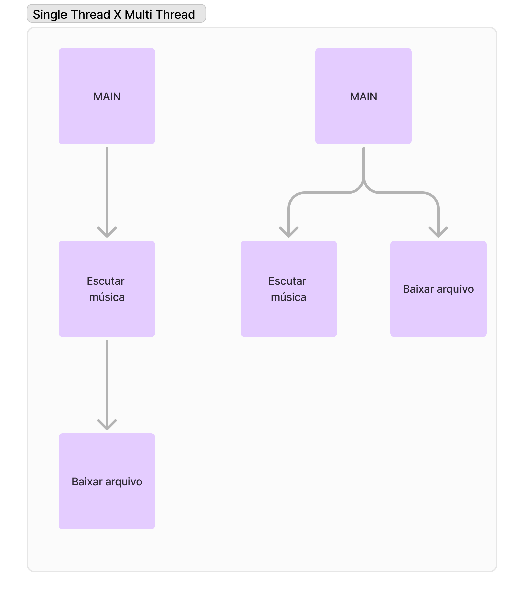

# POC Rust data races
Threads safety data races from C to Rust.

## Threads
Thread é uma forma como um processo/tarefa de um software é divido em duas ou mais tarefas que podem ser executadas concorrentemente ("simultâneo"). 

De forma muito abstrata podemos pensar nas threads dessa forma
<h1 align="left">
  
</h1>

## POC

### Software
Vamos pensar em uma função de um sistema que:
1. Recebe um batch de transações no seguinte formato
```json
"balance": 1000
"transactions": [100, -100, -50]
```
2. Processa cada um dos valores em cima do saldo e ao fim informa o saldo atual

### Processamento multi threads
Para esse software vamos usar o **processamento multi threads** para agilizar a aplicação dessas transações, ao invés de processarmos de forma linear esses valores vamos processar ele em **multi threads*** com isso conseguimos ao mesmo tempo, processar mais de uma transação.

Ao escolher processar dessa forma ganhamos tempo de processamento e aproveitamos melhor os recursos da máquina mas também traz um problema, a partir do momento que optamos por processar esses valores em **multi threads** precisamos nos preocupar com **race conditions** entre esses valores

### O que é race condition?
Ao optarmos por um ambiente com **processamento multi threads** pode acontecer o que chamamos de **race conditions**, no momento em que 2 threads acessam e modificam um mesmo valor temos uma condição de corrida, esse problema acontece, pois não é garantido um sincronismo do valor acessado e modificado em cada thread devido à concorrência entre as chamada. 
</br>Ex:
<h1 align="left">
  
</h1>

### Software em C
Vamos implementar o sistema citado acima em C e ver o problema acontecendo

```c
int saldo = 1000; 

int main() {
    int transactions[] = {100, -50, 200, -150, 300, -200, 150, -100, 50, -50};
    int num_transactions = sizeof(transactions) / sizeof(transactions[0]);

    pthread_t threads[num_transactions];

    // Cria uma thread para cada transação
    for (int i = 0; i < num_transactions; i++) {
        pthread_create(&threads[i], NULL, processar_transacao, &transactions[i]);
    }

    // Aguarda todas as threads terminarem
    for (int i = 0; i < num_transactions; i++) {
        pthread_join(threads[i], NULL);
    }

    printf("Saldo final da conta: %d\n", saldo);
    return 0;
}
```
Processando as transacoes
```c
void creditar(int valor) {
    int tmp_saldo = saldo;

    // Delay aleatório entre 1 e 10
    int random_sleep_time = rand() % 10;
    sleep(random_sleep_time);
    
    saldo = tmp_saldo + valor;
    printf("Creditado: %d | Saldo atual: %d\n", valor, saldo);
}

void debitar(int valor) {
    int temp = saldo;

    // Delay aleatório entre 1 e 10
    int random_sleep_time = rand() % 10;
    sleep(random_sleep_time);

    if (temp >= valor) {
        saldo = temp - valor;
        printf("Debitado: %d | Saldo atual: %d\n", valor, saldo);
    } else {
        printf("Saldo insuficiente para debitar: %d | Saldo atual: %d\n", valor, saldo);
    }
}

// Função que cada thread executará
void* processar_transacao(void* arg) {
    int valor = *(int*)arg;

    if (valor > 0) {
        creditar(valor);
    } else {
        debitar(abs(valor));
    }

    return NULL;
}

```
Agora vamos compilar e executar
```shell
    gcc ./c-version/race_condition.c -o ./c-version/target/race-condition && ./c-version/target/race-condition
```

Aqui podemos ver que cada vez em que executamos o programa temos um resultado de saldo final diferente, isso acontece, pois múltiplas threads acessam o mesmo valor de saldo de forma simultânea, assim quando vão modificá-las o valor se torna inconsistente. Sendo um erro muito grave e silencioso, em um grande sistema pode causar graves problemas.

### Usando Mutex para sincronização
Mutex é um primitivo de sincronização que garante que apenas um thread tenha acesso a um recurso compartilhado por vez. O acrônimo mutex vem do termo em inglês mutual exclusion, que significa "exclusão mútua". 

Quando um thread adquire um mutex, qualquer outro thread que tente adquirir o mesmo mutex é suspenso até que o primeiro thread libere o mutex. Isso evita que dois ou mais processos, ou threads tenham acesso simultâneo ao recurso compartilhado, o que é conhecido como seção crítica. 
 
O mutex é uma técnica de programação concorrente que garante a integridade dos dados compartilhados e evita raças de dados. 
</br>Ex:
<h1 align="left">
  
</h1>

```c
int saldo = 1000; 
pthread_mutex_t saldo_mutex; // Mutex para proteger o saldo

void creditar(int valor) {
    // Bloqueia o mutex
    pthread_mutex_lock(&saldo_mutex); 
    saldo += valor;
    printf("Creditado: %d | Saldo atual: %d\n", valor, saldo);
    // Libera o mutex
    pthread_mutex_unlock(&saldo_mutex);
}

void debitar(int valor) {
    // Bloqueia o mutex
    pthread_mutex_lock(&saldo_mutex); 
    if (saldo >= valor) {
        saldo -= valor;
        printf("Debitado: %d | Saldo atual: %d\n", valor, saldo);
    } else {
        printf("Saldo insuficiente para debitar: %d | Saldo atual: %d\n", valor, saldo);
    }
    // Libera o mutex
    pthread_mutex_unlock(&saldo_mutex); 
}
```

Agora vamos compilar e executar
```shell
    gcc ./c-version/safe_race_condition.c -o ./c-version/target/safe_race-condition && ./c-version/target/safe_race-condition
```
Aqui vemos que nosso código está mantendo a consistência ao processar as transações, sempre resultando no mesmo valor de saldo final.

## Rust

```
Rust’s rich type system and ownership model guarantee memory-safety and thread-safety — enabling you to eliminate many classes of bugs at compile-time. (Texto altamente controverso)
```
Pensar em Rust como uma linguagem ausente de data race não é produtivo, mas podemos entender como os tipos lineares  e seu compilador contribuem trazendo recursos ótimos para segurança de memória e thread. 

### Posse e Empréstimo (Ownership and Borrowing):
Quando você tenta compartilhar dados mutáveis entre threads, o compilador verifica as regras de posse e exigirá o uso de estruturas como Arc<Mutex<T>> ou Arc<RwLock<T>> para garantir que apenas uma thread modifique o dado de cada vez.

### Exclusividade de Acesso (Mutabilidade Exclusiva):
Rust exige exclusividade para acesso mutável. Isso significa que, para modificar dados, apenas uma thread (ou uma parte do código) pode ter acesso mutável a eles em um dado momento.
O uso de estruturas como Mutex ou RwLock é obrigatório para garantir que somente uma thread tenha acesso mutável a um recurso compartilhado, evitando condições de corrida.

### Verificação em Tempo de Compilação:
O compilador de Rust verifica essas garantias de segurança em tempo de compilação. Se o código não atende aos requisitos de segurança, ele falha na compilação, exibindo mensagens de erro claras.

### Rust Arc<>
Arc (Atomic Reference Counting): permite que múltiplas threads compartilhem a propriedade de um valor, sem que seja copiado para cada thread. Arc é utilizado para que um valor tenha múltiplos donos em threads diferentes.

Quando você usa apenas Arc<T>, o tipo contido em Arc deve ser imutável que por si só permite apenas compartilhar a propriedade do dado entre threads, mas ele não controla a mutabilidade. 

```rust
use std::sync::Arc;
use std::thread;

fn main() {
    let valor = Arc::new(100); // valor imutável compartilhado

    let handles: Vec<_> = (0..5).map(|_| {
        let valor = Arc::clone(&valor);
        thread::spawn(move || {
            println!("Valor: {}", valor);
        })
    }).collect();

    for handle in handles {
        handle.join().unwrap();
    }
}

```

### Rust Mutex<>
Mutex (Mutual Exclusion): Garante que apenas uma thread possa acessar o dado no momento, bloqueando as outras threads até que o recurso esteja disponível novamente.

Quando você usa Arc<Mutex<T>>, cada thread que quer acessar o dado precisa chamar .lock() para obter um bloqueio exclusivo no valor. Esse bloqueio impede que outras threads leiam ou escrevam o valor até que o bloqueio seja liberado.

Como .lock() Funciona:
1. Espera Exclusiva: Ao chamar .lock(), a thread atual bloqueia o Mutex e adquire o acesso exclusivo ao dado. Durante esse tempo, nenhuma outra thread pode obter o bloqueio (nem para leitura, nem para escrita).
2. Liberação do Bloqueio: Quando a thread termina de usar o valor e o bloqueio é liberado (automaticamente, ao sair do escopo onde lock() foi chamado), outra thread poderá obter o bloqueio e acessar o dado.
3. Esperando pelo Bloqueio: Se uma segunda thread tentar chamar .lock() enquanto o valor está bloqueado, ela vai esperar até que a primeira thread libere o bloqueio. Esse mecanismo evita condições de corrida, mas pode causar um pequeno atraso (latência), pois as threads ficam esperando o acesso.
```rust
use std::sync::{Arc, Mutex};
use std::thread;

fn main() {
    let saldo = Arc::new(Mutex::new(1000));

    let handles: Vec<_> = (0..5).map(|i| {
        let saldo = Arc::clone(&saldo);
        thread::spawn(move || {
            let mut valor = saldo.lock().unwrap();
            *valor += i * 10; // Modifica o saldo de maneira segura
            println!("Thread {} incrementou o saldo para {}", i, *valor);
        })
    }).collect();

    for handle in handles {
        handle.join().unwrap();
    }

    println!("Saldo final: {}", *saldo.lock().unwrap());
}
```

### RwLock
Quando usamos RwLock (Read-Write Lock) em Rust, ele permite que múltiplas threads acessem o valor para leitura simultânea (sem bloquear umas às outras), mas restringe o acesso a uma única thread para escrita exclusiva. Isso é útil quando há mais operações de leitura do que de escrita, pois as leituras podem acontecer em paralelo, enquanto as escritas ainda são feitas de forma segura e exclusiva.
Como Funciona o RwLock
Leitura com .read():
1. Quando uma thread chama .read() em um RwLock, ela obtém um bloqueio de leitura. Esse bloqueio permite que várias threads acessem o dado para leitura ao mesmo tempo.
Enquanto uma ou mais threads possuem um bloqueio de leitura, nenhuma thread pode obter um bloqueio de escrita.
Escrita com .write():
2. Quando uma thread chama .write() em um RwLock, ela obtém um bloqueio de escrita, que é exclusivo.
Enquanto uma thread possui o bloqueio de escrita, nenhuma outra thread pode obter bloqueios de leitura ou de escrita.
3. As threads que tentarem obter um bloqueio de leitura ou escrita enquanto o RwLock está com um bloqueio de escrita terão que esperar até que o bloqueio seja liberado.
Controle de Concorrência com RwLock:

Ou seja, o Mutext mesmo quando vai fazer uma leitura bloqueia o valor, já o RwLock somente bloqueia a leitura do valor quando foi solicitado a escrita dele, sendo mais vantajoso para quando temos muitas operações de leitura e poucas de escrita.

## Exemplo

### Sem o uso das structs Arc e Mutex
```rust
fn main() {
    // saldo mutável, mas sem proteção
    let mut saldo = 1000; 

    // erro: `saldo` é movido para esta thread sem proteção
    let handle1 = thread::spawn(move || {
        saldo += 100; 
    });

    // erro: `saldo` é movido para esta thread sem proteção
    let handle2 = thread::spawn(move || {
        saldo -= 50; 
    });

    handle1.join().unwrap();
    handle2.join().unwrap();

    println!("Saldo final: {}", saldo);
}
```
Rust não permite o acesso direto a um dado mutável(saldo) a partir de várias threads sem proteção.
O compilador vai gerar um erro porque saldo está sendo movido para várias threads (handle1 e handle2) sem um mecanismo seguro.
Mensagem de erro que você pode ver:
```shell
plaintext
Copy code
error[E0382]: use of moved value: `saldo`
```

### Como Resolver: Usando Mutex com Arc
Agora vamos ver como seria nosso código C para corrigir isso, usando Arc<Mutex<T>>, que é seguro para compartilhamento entre threads:
```rust
use rand::Rng;
use std::sync::{Arc, Mutex};
use std::{thread, time};

struct ContaBancaria {
    saldo: i32,
}

impl ContaBancaria {
    fn creditar(&mut self, valor: i32) {
        self.saldo += valor;
        println!("Creditado: {} | Saldo atual: {}", valor, self.saldo);
    }

    fn debitar(&mut self, valor: i32) {
        if self.saldo >= valor {
            self.saldo -= valor;
            println!("Debitado: {} | Saldo atual: {}", valor, self.saldo);
        } else {
            println!(
                "Saldo insuficiente para debitar: {} | Saldo atual: {}",
                valor, self.saldo
            );
        }
    }

    fn consultar_saldo(&self) -> i32 {
        self.saldo
    }
}

fn main() {
    rust_multi_threads_transaction();
}

fn rust_multi_threads_transaction() {
    // Cria a conta com Arc
    let conta = Arc::new(Mutex::new(ContaBancaria { saldo: 1000 }));

    let mut handles = vec![];
    let transactions = [100, -50, 200, -150, 300, -200, 150, -100, 50, -50];

    for transaction in transactions {
        let conta = Arc::clone(&conta);

        let handle = thread::spawn(move || {
            let random_sleep_time = rand::thread_rng().gen_range(0..10);
            thread::sleep(time::Duration::from_secs(random_sleep_time));

            if transaction > 0 {
                conta.lock().unwrap().creditar(transaction);
            } else {
                conta.lock().unwrap().debitar(transaction.abs());
            }
        });

        handles.push(handle);
    }

    // Espera todas as threads terminarem
    for handle in handles {
        handle.join().unwrap();
    }

    let saldo_final = conta.lock().unwrap().consultar_saldo();
    println!("Saldo final da conta: {}", saldo_final);
}
```

### Extra
- deadlocks

### Refs
https://en.wikipedia.org/wiki/Race_condition
https://blog.bughunt.com.br/o-que-sao-vulnerabilidades-race-condition/
https://medium.com/cwi-software/spring-boot-race-condition-e-ambiente-multi-thread-263b21e0042e
https://learn.microsoft.com/en-us/troubleshoot/developer/visualstudio/visual-basic/language-compilers/race-conditions-deadlocks
https://www.reddit.com/r/rust/comments/18faxjg/understanding_threadsafety_vs_race_conditions/?rdt=52263
https://doc.rust-lang.org/nomicon/races.html
https://news.ycombinator.com/item?id=23599598